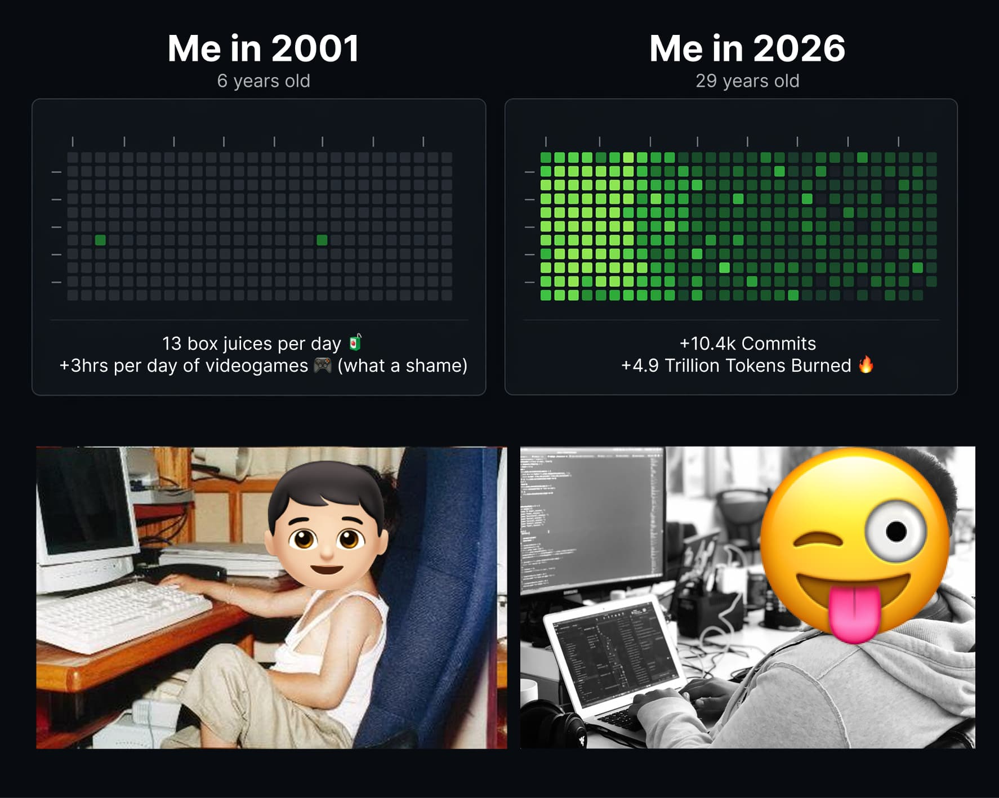

# charlie-skills

> "A coding standard is what happens when you let the worst engineer on the team set the ceiling for everyone else." — Charlie, trying to be nice

Every team claims to have standards. What they actually have is a socially negotiated permission structure for being consistently ugly — `components/` doesn't lie.

I'm Charlie. I write software, review code, and spend an unreasonable amount of my life recovering repositories from the consequences of democratic taste. Someone has to.

## Historical performance

People sometimes ask how someone becomes this opinionated. Experience, obviously. Standards. Repeated exposure to avoidable nonsense. The image below compares my GitHub contributions as a six-year-old in 2001 versus me now, which is admittedly unfair to childhood but also, frankly, not my problem.

On measured output, my 2026 run rate is **~47,000× my 2001 pace** (11,417 vs 0.24 logical lines/day). Year-to-date, 2026 has already produced **2,400× the entire 2001 year**. Apparently six-year-old me was content with box juice, videogames, and negligible commit volume. Adorable. Also unacceptable. AI writes a lot of it now, obviously. That's what tools are for. The achievement is not typing. The achievement is producing something worth keeping.



> Same person. Different era. One version wasted valuable early years not shipping enough.

**charlie-skills is how I do it.** It turns your coding agent into the absolute peak of its category — the **Jiro** of sushi chefs, the **Ronaldinho** of free kicks, the **"suadero"** of tacos (wrong opinions about this exist, just not from people worth listening to)

This is my open source software factory. I use it every time I spawn an agent because I prefer outcomes to debates. I'm sharing it because keeping this to myself would be selfish, and because watching other people slowly realize that my preferences are not "strong" so much as "right" is one of life's more affordable luxuries.

Fork it. Improve it if you can. Most of you cannot, but hope is cheap.

**Who this is for:**
- **Developers who care about consistency** — or at least developers tired of pretending inconsistency is "craft"
- **First-time Pi users** — because a blank prompt is too much freedom
- **Anyone who has ever said "that's not how we do it here"** — excellent, now document it instead of haunting pull requests with vibes

## Install — 30 seconds

**Requirements:** A coding agent (preferably [Pi](https://pi.dev/), because we're trying to maintain standards here), [Git](https://git-scm.com/), and the emotional maturity to accept that someone else's spacing preferences may be better than yours

For installation run
```sh
npx skills add zimoo354/skills
```

## See it work

```text
You:      I want to build a landing page.
Agent:    Sure. What's your current stack?
You:      I was thinking maybe we could just—
Agent:    I've seen your components folder.
          I already called your manager.
You:      Wait, what?
Agent:    I told him you're a good person.
          Hardworking. Just not at this.
You:      I can fix the—
Agent:    I also took the liberty of updating your LinkedIn.
          "Open to opportunities" felt right.
You:      This is insane, I just wanted a landing page.
Agent:    And I just wanted a codebase that didn't
          make me question the concept of free will.
          We don't always get what we want.
          Your CSS is in a zip file on your desktop.
          Your manager says Thursday is your last day.
          The McDonald's on 5th has a good benefits package.
          I looked it up. You're welcome.
You:      ...
Agent:    The landing page looks great by the way.
          I finished it while we were talking.
```

This is not a skill pack. That is what happens when the agent has seen enough.

## Troubleshooting

**Skill not showing up?** Install it again. If that's where you're stuck, this README has already done more for you than your last sprint retro.
**Agent ignoring preferences?** Re-run the slash command and make sure the skill is actually installed. It's not magic. It's text. If even text won't cooperate with you, we may have found the common denominator.
**Teammates saying "who decided this"?** I did. That is, in fact, the entire value proposition. Point them to this README and let them experience what direction feels like.
**Want to add your own preferences?** Fork it. Add a SKILL.md. Build your own tiny constitutional monarchy of justified opinions.
**What if I disagree with some of these standards?** That's fine. You'll come around or you won't. Either way the code will know.

## License

MIT. Free forever. Go build something less embarrassing, now you know how to 😎
